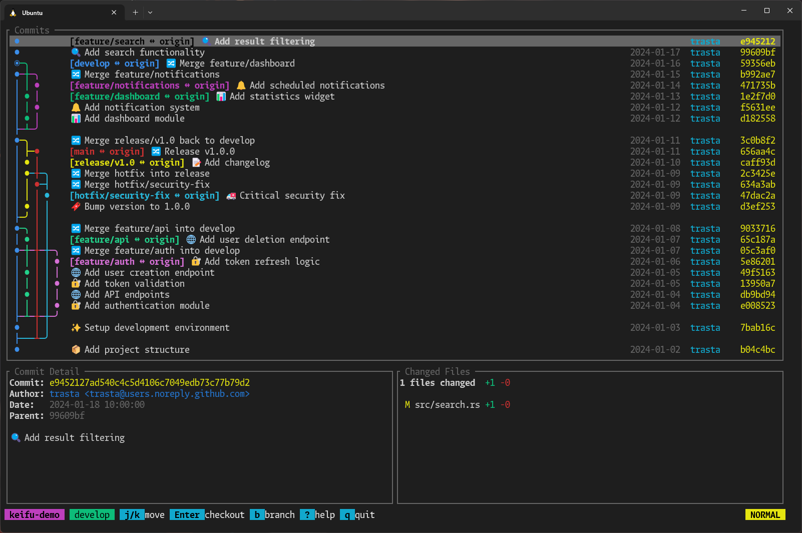

# 🧬 keifu

[](https://crates.io/crates/keifu)
[](https://ratatui.rs)

[日本語版はこちら](docs/README_JA.md)

keifu (系譜, /keːɸɯ/) is a terminal UI tool that visualizes Git commit graphs. It shows a colored commit graph, commit details, and a summary of changed files, and lets you perform everyday Git operations: branch switching, staging, committing, and pushing — with full mouse support.



## Motivation

- **Readable commit graph** — `git log --graph` is hard to read; keifu renders a cleaner, color-coded graph
- **Fast branch switching** — With the rise of vibe coding, working on multiple branches in parallel has become common. keifu makes branch switching quick and visual
- **Keep it simple** — Only basic Git operations are supported; this is not a full-featured Git client
- **Narrow terminal friendly** — Works well in split panes and small windows
- **No image protocol required** — Works on any terminal with Unicode support

## Features

- Unicode commit graph with per-branch colors
- Commit list with branch labels, date, author, short hash, and message (some fields may be hidden on narrow terminals)
- Commit detail panel with full message and changed file stats (+/-)
- File diff view with syntax highlighting and word-level change emphasis
- Git operations: checkout, create/delete branch, fetch, stage/unstage, commit, push
- Mouse support: click to select commits/files/panes, clickable status bar hints, per-pane wheel scrolling
- Branch search with dropdown UI
- Remote-control debug server and file logging for agent-driven debugging (see [docs/debugging.md](docs/debugging.md))

## Requirements

- Run inside a Git repository (auto-discovery from current directory)
- A terminal with Unicode line drawing support and color
- `git` command in PATH (required for fetch/push)
- Rust toolchain (for building from source)

## Installation

### From crates.io

```bash
cargo install keifu
```

### With mise

```bash
mise use -g github:trasta298/keifu@latest
```

### With Homebrew

```bash
brew install trasta298/tap/keifu
```

### From source

```bash
git clone https://github.com/trasta298/keifu && cd keifu && cargo install --path .
```

## Usage

Run inside a Git repository:

```bash
keifu
```

## Configuration

See [docs/configuration.md](docs/configuration.md) for configuration options.

## Keybindings

### Navigation

| Key | Action |
| --- | --- |
| `j` / `↓` | Move down (scrolls the detail pane when focused) |
| `k` / `↑` | Move up (scrolls the detail pane when focused) |
| `Tab` | Switch pane focus (graph / commit detail) |
| `]` | Jump to next commit that has branch labels |
| `[` | Jump to previous commit that has branch labels |
| `h` / `←` | Select left branch (same commit) |
| `l` / `→` | Select right branch (same commit) |
| `Ctrl+d` | Page down |
| `Ctrl+u` | Page up |
| `g` / `Home` | Go to top |
| `G` / `End` | Go to bottom |
| `@` | Jump to HEAD (current branch) |
| `Space` | Open file diff view |

### Git operations

| Key | Action |
| --- | --- |
| `Enter` | Checkout selected branch/commit |
| `b` | Create branch at selected commit |
| `d` | Delete branch (local, non-HEAD) |
| `f` | Fetch from origin |
| `c` | Commit staged changes (opens message dialog) |
| `p` | Push current branch to origin |

### File list (Space) / staging

Staging keys work when the "uncommitted changes" row is selected.

| Key | Action |
| --- | --- |
| `j` / `k` | Select file |
| `Enter` | Open file diff |
| `s` | Stage / unstage selected file |
| `a` | Stage all changes |
| `u` | Unstage all changes |
| `c` | Commit staged changes |
| `Esc` / `q` | Back |

### Mouse

| Input | Action |
| --- | --- |
| Click on a commit row | Select commit (double-click opens the file list) |
| Click on a file row | Select file (double-click opens the diff) |
| Click on a pane | Focus the pane |
| Click on a status bar hint | Run that action |
| Wheel scroll | Scrolls the pane under the cursor |

Since keifu captures mouse input, use your terminal's modifier for native
text selection (usually `Shift` + drag; `Fn` + drag on iTerm2).

Note: Ghostty currently fans one wheel notch out into multiple scroll events
for mouse-mode apps ([ghostty#3955](https://github.com/ghostty-org/ghostty/discussions/3955)),
which can scroll a few extra lines per notch. Lowering `mouse-scroll-multiplier`
in the Ghostty config works around it.

### Search

| Key | Action |
| --- | --- |
| `/` | Search branches (incremental fuzzy search) |
| `↑` / `Ctrl+k` | Select previous result |
| `↓` / `Ctrl+j` | Select next result |
| `Enter` | Jump to selected branch |
| `Esc` / `Backspace` on empty | Cancel search |

### File diff view

| Key | Action |
| --- | --- |
| `j` / `k` / `↑` / `↓` | Scroll up/down |
| `h` / `l` / `←` / `→` | Scroll left/right |
| `Ctrl+d` / `Ctrl+u` | Half-page down/up |
| `Ctrl+f` / `Ctrl+b` | Full page down/up |
| `g` / `G` | Go to top/bottom |
| `0` | Scroll to line start |
| `]` / `[` | Jump to next/previous hunk |
| `n` / `N` | Jump to next/previous file |
| `Esc` / `q` | Back to file select / close |

### Other

| Key | Action |
| --- | --- |
| `y` | Copy commit hash to clipboard (OSC 52) |
| `Y` | Copy branch name to clipboard (OSC 52) |
| `R` | Refresh repository data |
| `o` | Toggle remote branches |
| `?` | Toggle help |
| `q` / `Esc` | Quit (returns focus to the graph first when the detail pane is focused) |

## Notes and limitations

- The TUI loads up to 500 commits across the visible branches.
- Merge commits are diffed against the first parent; the initial commit is diffed against an empty tree.
- Changed files are capped at 50. Binary files are shown without line stats.
- If there are staged, unstaged, or untracked changes, an "uncommitted changes" row appears at the top.
- When multiple branches point to the same commit, the label is collapsed to a single name with a `+N` suffix (e.g., `main +2`). Use `h`/`l` or `←`/`→` to switch between them.
- Checking out `origin/xxx` creates or updates a local branch. Upstream is set only when creating a new branch. If the local branch exists but points to a different commit, it is force-updated to match the remote.
- Remote branches are displayed by default. Press `o` to hide them; when hidden, commits reachable only from remote branches are excluded from the graph.
- Delete operations only work with local branches.
- Fetch and push require the `origin` remote to be configured. Staging works per file (no hunk-level staging); commits include only staged changes, like plain `git commit`.

## License

MIT
